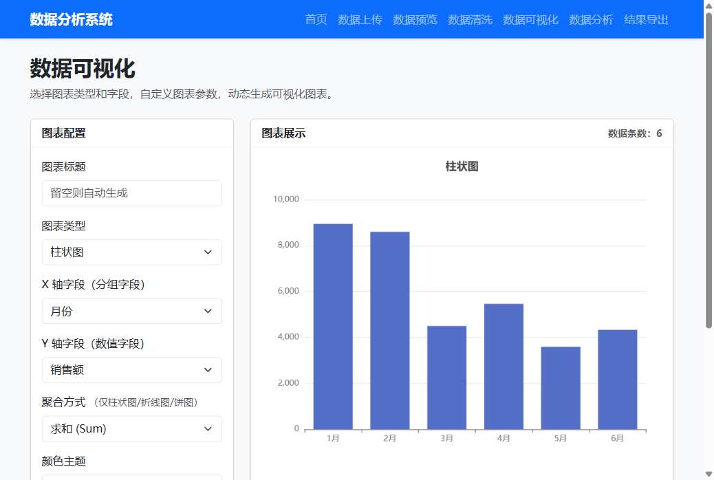
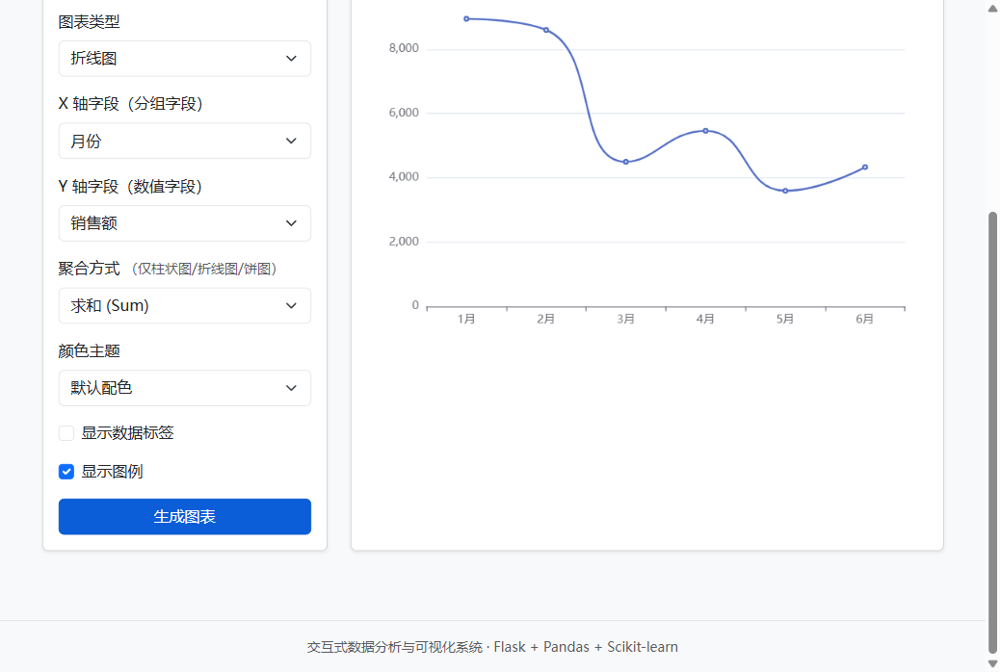
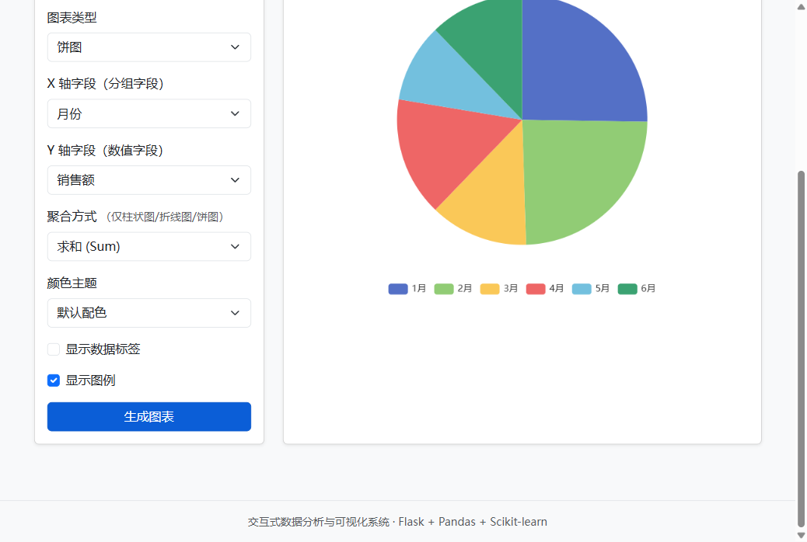
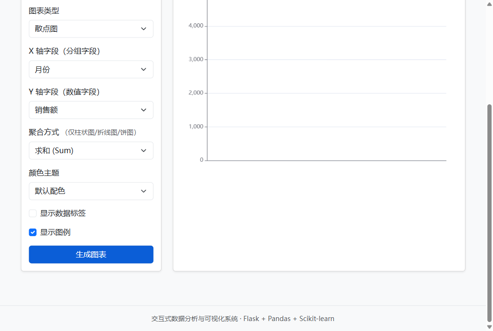
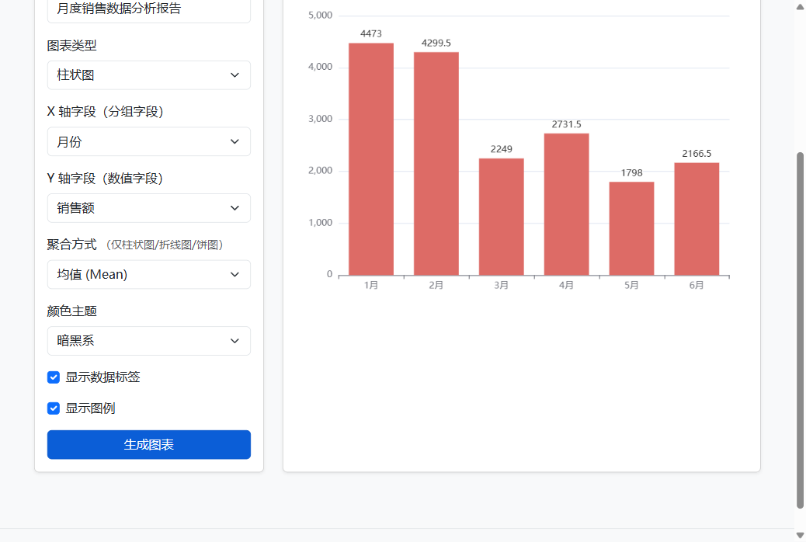

<p align="center">
  <br>
  <b style="font-size:28px;">📊 个人成果展示文档</b>
  <br><br>
  <span style="font-size:16px;">文件数据分析与可视化综合应用</span>
  <br>
  <span style="font-size:16px;">交互式数据分析系统开发</span>
</p>

<br>

| | |
|---|---|
| **姓　名** | （你的名字） |
| **学　号** | （你的学号） |
| **个人分工** | 数据可视化模块 |
| **技术栈** | Flask · Pandas · ECharts 5 · Bootstrap 5 |
| **提交日期** | 2026年6月 |

<br>

---

## 📋 目录

1. [系统分析与设计](#一系统分析与设计)
2. [系统整体功能模块描述](#二系统整体功能模块描述)
3. [负责的功能模块详细说明](#三负责的功能模块详细说明可视化模块) ⭐️ 重点
4. [系统运行截图](#四系统运行截图)
5. [遇到的典型问题及解决方案](#五遇到的典型问题及解决方案)
6. [个人收获与改进建议](#六个人收获与改进建议)

---

## 一、系统分析与设计

### 1.1 系统架构

本项目采用 **Flask 后端 + Jinja2 模板引擎 + ECharts 图表库** 的经典 Web 架构：

```
┌──────────┐     ┌──────────────┐     ┌──────────┐     ┌──────────────┐
│ 用户浏览器 │ ──▶ │  Flask 路由   │ ──▶ │  Pandas   │ ──▶ │  JSON API    │
│ (ECharts) │ ◀── │  (app.py)    │ ◀── │  数据处理  │ ◀── │  数据返回    │
└──────────┘     └──────────────┘     └──────────┘     └──────────────┘
```

| 层级 | 技术 | 职责 |
|------|------|------|
| 后端框架 | Flask 3.1 | 路由分发、Session 管理、请求处理 |
| 数据处理 | Pandas 2.3 | CSV/Excel 加载、groupby 分组聚合 |
| 前端渲染 | Jinja2 + Bootstrap 5 | 模板继承、响应式布局 |
| 图表绘制 | ECharts 5 (CDN) | 柱状图/折线图/饼图/散点图渲染 |

### 1.2 数据处理流程

```
上传 → 加载 → 清洗 → ⭐可视化 ← 分析 → 导出
         ↓       ↓        ↓        ↓
    data_loader  cleaner   我负责   analyzer
```

我在整个流程中的位置：接收清洗后的数据 → 提供前端配置界面 → API 分组聚合 → ECharts 渲染。

---

## 二、系统整体功能模块描述

| 模块 | 核心功能 | 负责人 |
|:------|:------|:------|
| 📁 数据管理 | CSV/Excel 上传、数据预览、结果导出 | 队友 |
| 🧹 数据清洗 | 缺失值填充（均值/中位数/众数）、IQR 异常值去除 | 队友 |
| **📊 数据可视化** | **4种图表动态生成 + 用户自定义参数** | **🔴 我** |
| 🤖 数据分析 | K-Means 聚类、线性回归、随机森林分类、PCA 降维 | 队友 |
| 🌐 Web 界面 | Bootstrap 响应式导航、Flash 消息交互 | 队友 |

> 我负责的可视化模块是系统的**核心展示层**，承接数据清洗结果，为用户提供直观的图表分析能力。

---

## 三、负责的功能模块详细说明（可视化模块）⭐️

### 3.1 功能清单

#### ✅ 4 种图表类型（满足"3种以上"要求）

| 图表 | ECharts type | 适用场景 |
|------|:---:|------|
| 柱状图 | `bar` | 分类数据对比，如各月销售额 |
| 折线图 | `line` | 趋势变化展示，如销量走势 |
| 饼图 | `pie` | 占比分布，如产品份额 |
| 散点图 | `scatter` | 变量相关性，如销量 vs 利润 |

#### ✅ 用户自定义图表参数（共 5 项）

| 参数 | 控件 | 选项 |
|------|------|------|
| 🏷️ 图表标题 | 文本输入框 | 自由输入，留空自动生成 |
| 📐 聚合方式 | 下拉选择 | 求和 (Sum) / 均值 (Mean) / 计数 (Count) |
| 🎨 颜色主题 | 下拉选择 | 默认 / 清新绿 / 暗黑系 / 复古风 |
| 🔢 数据标签 | 复选框 | 显示/隐藏图表上方的数值 |
| 📖 图例 | 复选框 | 显示/隐藏底部图例 |

### 3.2 实现思路

**核心设计：前后端分离的数据交互**

```
用户在配置面板选择参数
        │
        ▼
前端 JS 读取参数 → POST /api/chart-data (JSON)
        │
        ▼
后端 Pandas 分组聚合 → 返回图表数据 (JSON)
        │
        ▼
前端构建 ECharts option → chart.setOption() 渲染
```

**四种图表的差异化处理：**

| 图表 | 后端返回格式 | ECharts series 配置 |
|------|-------------|-------------------|
| 柱状图/折线图 | `{x: [...], y: [...]}` | `{type: 'bar'/'line', data: y}` |
| 饼图 | `{data: [{name, value}]}` | `{type: 'pie', data: [...]}` |
| 散点图 | `{data: [[x,y], ...]}` | `{type: 'scatter', data: [...]}` |

### 3.3 后端 API 设计

**接口：** `POST /api/chart-data`

**请求体 (JSON)：**

```json
{
  "chart_type": "bar",
  "x_col": "月份",
  "y_col": "销售额",
  "agg_method": "sum"
}
```

| 参数 | 类型 | 必填 | 说明 |
|:------|:------|:------|:------|
| `chart_type` | string | ✅ | `bar` / `line` / `pie` / `scatter` |
| `x_col` | string | ✅ | X 轴/分组字段名（来自数据列） |
| `y_col` | string | ✅ | Y 轴/数值字段名（来自数据列） |
| `agg_method` | string | ❌ | `sum`(默认) / `mean` / `count` |

**返回体 (JSON)：**

```json
{
  "x": ["1月", "2月", "3月"],
  "y": [4174, 4507, 1860],
  "chart_type": "bar",
  "data_count": 3
}
```

### 3.4 核心代码实现

**后端 — 聚合逻辑 (`app.py`)：**

```python
@app.route("/api/chart-data", methods=["POST"])
def chart_data():
    """
    可视化图表数据接口
    接收前端配置参数，使用 Pandas 分组聚合后返回 JSON
    """
    df = _get_current_df()
    chart_type = request.json.get("chart_type")
    x_col = request.json.get("x_col")
    y_col = request.json.get("y_col")
    agg_method = request.json.get("agg_method", "sum")

    # 核心：根据用户选择的聚合方式动态处理数据
    def _aggregate(df, x_col, y_col, method):
        grouped = df[[x_col, y_col]].dropna().groupby(x_col, as_index=False)
        if method == "mean":
            return grouped.mean(numeric_only=True)
        elif method == "count":
            return grouped.count(numeric_only=True)
        else:
            return grouped.sum(numeric_only=True)

    if chart_type in {"bar", "line"}:
        grouped = _aggregate(df, x_col, y_col, agg_method)
        return {
            "x": grouped[x_col].astype(str).tolist(),
            "y": grouped[y_col].tolist(),
            "chart_type": chart_type,
            "data_count": len(grouped),
        }
    # ... 饼图、散点图类似处理
```

**前端 — 自定义参数应用 (`templates/visualize.html`)：**

```javascript
// 颜色主题预设（4 种方案）
const colorThemes = {
    default: ['#5470c6','#91cc75','#fac858','#ee6666',...],
    fresh:  ['#2ec4b6','#e71d36','#ff9f1c','#011627',...],
    dark:   ['#dd6b66','#759aa0','#e69d87','#8dc1a9',...],
    vintage:['#d87c7c','#919e8b','#d7ab82','#6e7074',...],
};

// 读取用户自定义参数，请求后端，构建 option 并渲染
document.getElementById('drawChart').addEventListener('click', async () => {
    const chartType = document.getElementById('chartType').value;
    const chartTitle = document.getElementById('chartTitle').value.trim();
    const colorTheme = document.getElementById('colorTheme').value;
    const showLabel = document.getElementById('showLabel').checked;
    const showLegend = document.getElementById('showLegend').checked;

    // 请求后端 API
    const resp = await fetch('/api/chart-data', {
        method: 'POST',
        headers: {'Content-Type': 'application/json'},
        body: JSON.stringify({chart_type: chartType, ...})
    });
    const data = await resp.json();

    // 构建 ECharts 配置并渲染
    const option = {
        color: colorThemes[colorTheme],
        title: {text: chartTitle || '图表', left: 'center'},
        tooltip: {},
        legend: {show: showLegend},
        series: [{
            type: chartType,
            data: data.y,
            label: {show: showLabel, position: 'top'},
        }]
    };
    chart.setOption(option, true);
});

// 窗口自适应
window.addEventListener('resize', () => chart.resize());
```

### 3.5 技术亮点

- 🎯 **单一 API 支持 4 种图表**：通过 `chart_type` 参数统一入口，避免多个接口
- 🎨 **4 种配色方案一键切换**：预设 colorThemes 对象，覆盖 ECharts 默认色板
- 📱 **响应式自适应**：监听 `window.resize`，图表大小随容器自动调整
- 🚀 **页面加载即渲染**：`DOMContentLoaded` 事件自动触发默认图表生成
- 🔄 **X 轴标签智能旋转**：数据 > 8 组时自动 30° 倾斜避免重叠

---

## 四、系统运行截图

### 4.1 柱状图 — 默认配置



> 默认配色 · X 轴 = 月份 · Y 轴 = 销售额 · 聚合 = 求和

### 4.2 折线图 — 趋势分析



> 平滑曲线 · 适合展示数据随时间的变化趋势

### 4.3 饼图 — 占比分布



> 环形布局 · 展示各分组在整体中的占比关系

### 4.4 散点图 — 变量关系



> 二维坐标 · 观察两个数值变量之间的分布与关联

### 4.5 自定义参数 — 完整效果



> **自定义标题**"月度销售数据分析报告" · **均值聚合** · **暗黑系配色** · **数据标签开启**

---

## 五、遇到的典型问题及解决方案

### 🔴 问题 1：聚合方式单一，无法满足不同分析需求

**现象：** 原有 `/api/chart-data` 接口只支持 `sum`（求和）聚合。当用户想看"月均销售额"或"各产品出现次数"时无能为力。

**解决：** 在后端新增 `agg_method` 参数，封装 `_aggregate()` 内部函数：

```python
def _aggregate(df, x_col, y_col, method):
    grouped = df[[x_col, y_col]].dropna().groupby(x_col, as_index=False)
    if method == "mean":
        return grouped.mean(numeric_only=True)
    elif method == "count":
        return grouped.count(numeric_only=True)
    else:
        return grouped.sum(numeric_only=True)
```

前端同步增加聚合方式下拉框，提供 Sum / Mean / Count 三个选项。

---

### 🔴 问题 2：浏览器窗口缩放后图表不跟随

**现象：** 用户调整浏览器窗口大小后，ECharts 图表保持原尺寸不动，出现空白或溢出。

**解决：** 添加一行事件监听即可：

```javascript
window.addEventListener('resize', () => chart.resize());
```

ECharts 实例的 `resize()` 方法会根据容器新尺寸自动重绘。

---

### 🔴 问题 3：X 轴标签过多时重叠模糊

**现象：** 当数据分组超过 8 个时，X 轴标签互相堆叠，完全无法辨认。

**解决：** 在构建 ECharts option 时加入智能判断：

```javascript
xAxis: {
    type: 'category',
    data: data.x,
    axisLabel: {
        rotate: data.x && data.x.length > 8 ? 30 : 0
    }
}
```

数据量 > 8 时自动倾斜 30 度，保证可读性。

---

## 六、个人收获与改进建议

### 💡 个人收获

| # | 收获 | 具体内容 |
|:--:|------|------|
| 1 | **前后端数据可视化闭环** | 完整走通了 Flask API → Pandas 聚合 → JSON 传输 → ECharts 渲染的全链路，理解了 Web 数据可视化的完整流程 |
| 2 | **ECharts 配置体系** | 深入掌握了 option 结构（title / tooltip / legend / xAxis / yAxis / series），能针对不同图表类型灵活拼装配置 |
| 3 | **用户体验思维** | 通过增加自定义参数（标题、配色、标签开关），把"固定展示"升级为"用户可配置"，理解了参数化设计对 UX 的价值 |
| 4 | **团队协作规范** | 在已有的 Flask + Jinja2 框架中增量开发，保持代码风格一致，不破坏队友的功能模块 |

### 🚀 改进建议

1. **更多图表类型** — 后续可引入雷达图、热力图、箱线图，覆盖更多分析场景
2. **图表导出** — 利用 ECharts 的 `getDataURL()` 方法，加一个"导出 PNG"按钮
3. **数据筛选联动** — 在可视化页面加入日期范围、数值阈值等过滤器，让分析更灵活
4. **配置记忆** — 将用户的图表配置存入 `sessionStorage`，刷新页面后恢复上次选择
5. **多图联动** — 支持同时展示多个图表，通过 `echarts.connect()` 实现刷选联动

---

<br>

<p align="center">
  <b>— END —</b>
</p>
